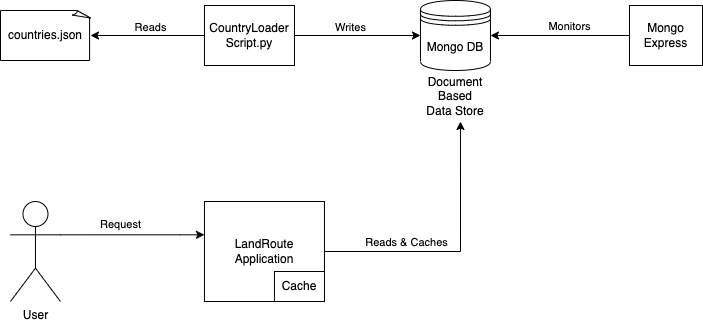
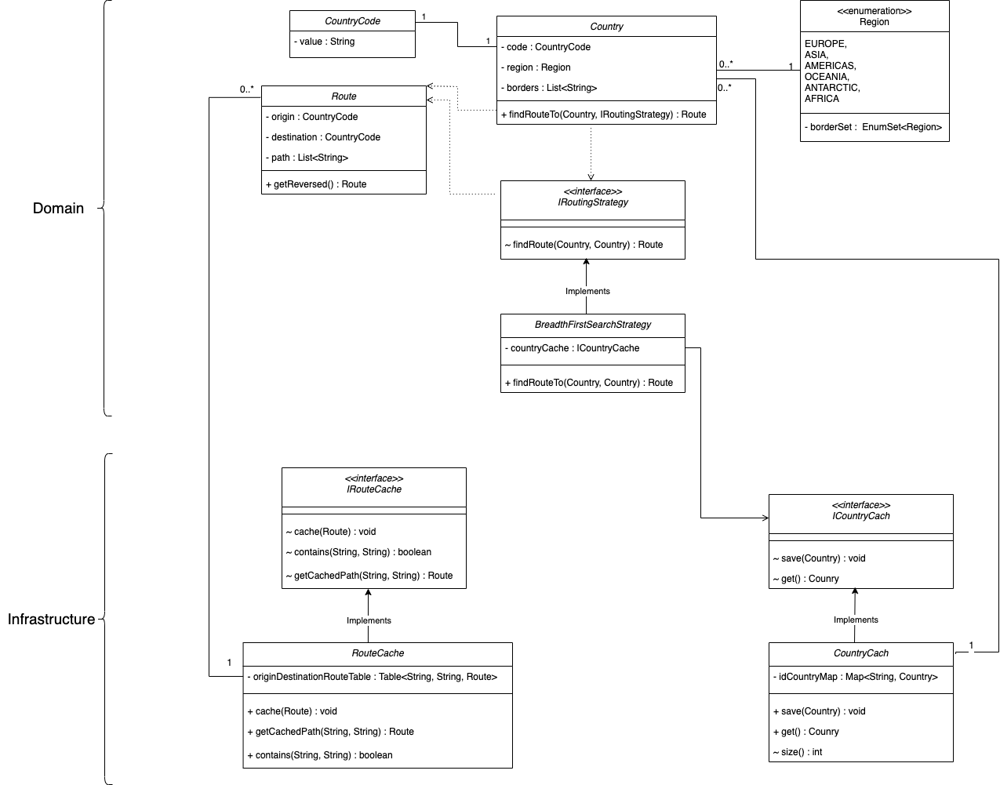

# LAND ROUTE FINDING APPLICATION

___

## ABOUT TASK:

Task is to create a simple Spring Boot service, that is able to calculate any possible land route from one country to
another. The objective is to take a list of country data in JSON format and calculate the route by utilizing individual
countries border information. Specifications:

- Spring Boot, Maven
- Data link: https://raw.githubusercontent.com/mledoze/countries/master/countries.json
- The application exposes REST endpoint /routing/{origin}/{destination} that returns a list of border crossings to get
  from origin to destination
- Single route is returned if the journey is possible
- Algorithm needs to be efficient
- If there is no land crossing, the endpoint returns HTTP 400
- Countries are identified by cca3 field in country data
- HTTP request sample (land route from Czech Republic to Italy):
    - GET /routing/CZE/ITA HTTP/1.0 :
      {
      "route": ["CZE", "AUT", "ITA"] }

**Expected deliveries:**

1. Source code
2. Instructions on how to build and run the application
___
## APPROACH

### HIGH LEVEL APPROACH:

The project consist of four component:

**1. countries-loader-script:**

- Python script that reads from countries.json file and loads to *pwc-mongo-countries* container.
- As the work load of this process is quite low, scripting approach has been chosen. Python makes a good fit with this
  need.
- Github link: https://github.com/umutkut/countries-json-loader-script

**2. pwc-mongo-countries:**

- Dockerized MongoDB image, tasked to contain country information.
- Since data is given as JSON file, JSON based document database would be better fit.
- The system does not require heavy and custom queries.
- With considering requirements MongoDB is considered as a good fit.

**3. mongo-express:**

- MongoDB monitoring tool.

**4. land-route:**

- The main SpringBoot application that handles the REST requests.
- As REST API is faster and more popular alternative over other standards that uses HTTP protocol, RESTfull approach is
  used.
- SpringBoot framework have been chosen in this project due to its dependency injection advantage, ease of development
  and so on.
- The application has two caching model,
    - On startup, the application caches the data from the database to memory. Since the data size is quite low, caching
      all data has not come to concern. Along with that, increases the performance dramatically.
    - On preparation of response, the request and response data is being cached. Which will provide faster operation if
      same request, or reversed of same request, taken place.

### LOW LEVEL APPROACH:

- Domain Driven Design is applied on this project.
- Main aggregate is Country, contains fields CountryCode, Borders and Region and a method that finds the land route to
  another country.
- As the main problem, finding route, is basically graph problem, BFS solution finally implemented.
    - DFS is also considered in this part and implemented previously, however BFS performed better and switched to BFS.
    - Used Strategy Pattern in this particular part to follow the open close principle. Figured there could be additions
      with another strategies and the strategy could differ via request inputs.

### OPEN TO IMPROVEMENT:
- Missing information in the JSON file:
  - Some countries have independent lands from their main land. However this independency is not specified in the countries.json file. This application assumes there is no independent lands for a country which causes false outputs.
  - Ex: There is a Russian land independent from the mainland of Russia above Poland. Which makes Russia and Poland neighbors. Russia and Georgia also has boarder from their main lands. With this information, the application can calculate land route from Poland to Georgia as: Poland -> Russia -> Georgia which is not correct.
- Approach on caching the routes does not contain any logic to delete unnecessary caches. This could cause too much memory usage. 
  - Some LRU or LFU logic could be applied here. 
___
## HOW TO RUN:

All related containers have been set in docker-compose.yaml.

In order to run the application,
- Open a terminal in the main directory.
- Run bellow command in terminal:

`docker compose up -d`
___
## END POINT:

**GET** localhost:8090/routing/{origin}/{destination}

origin: cca3 format country code.

destination: cca3 format country code.